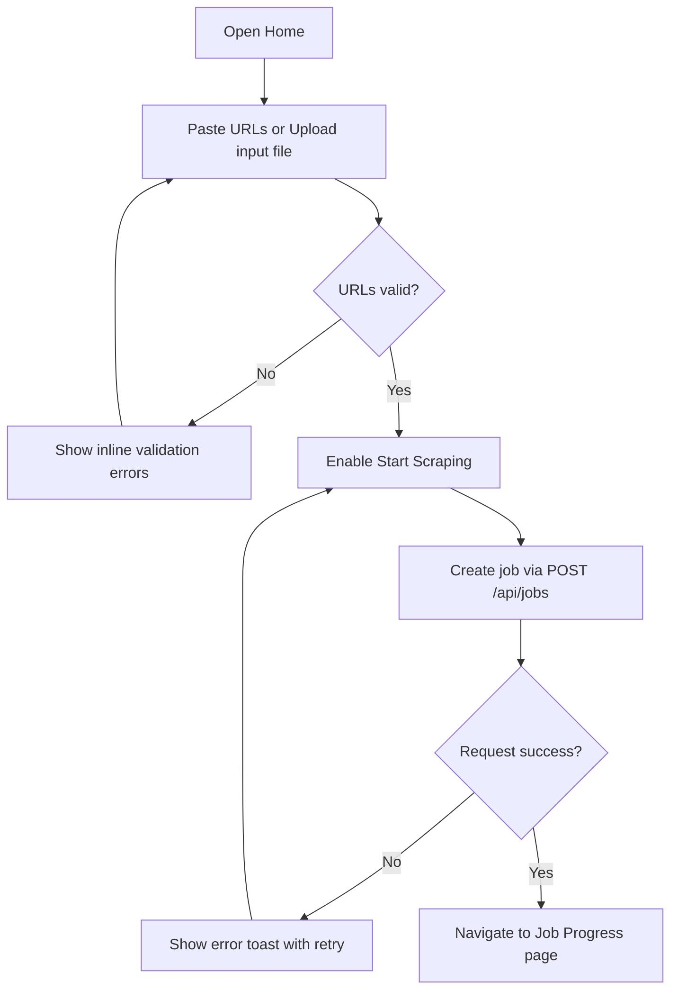
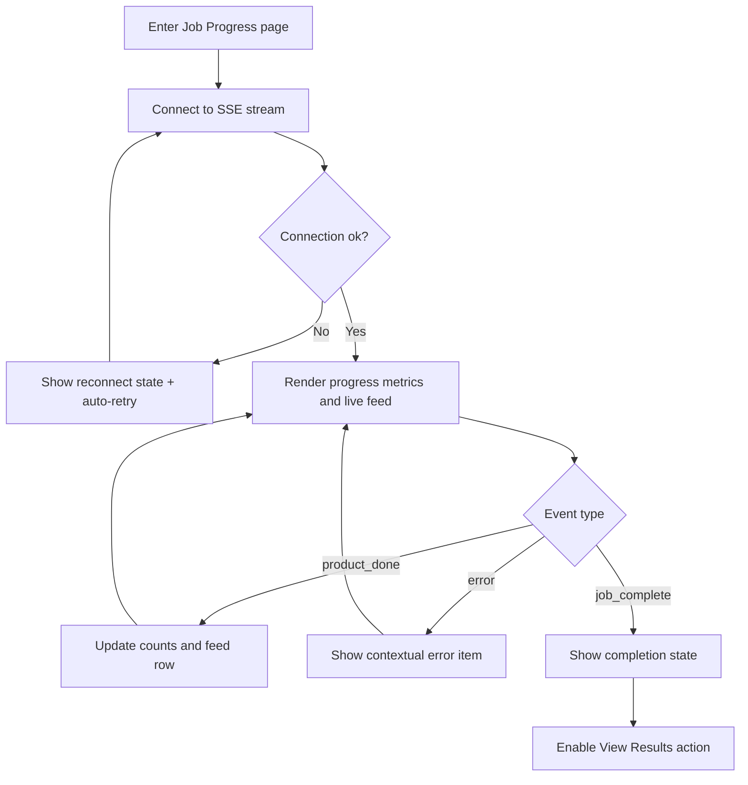
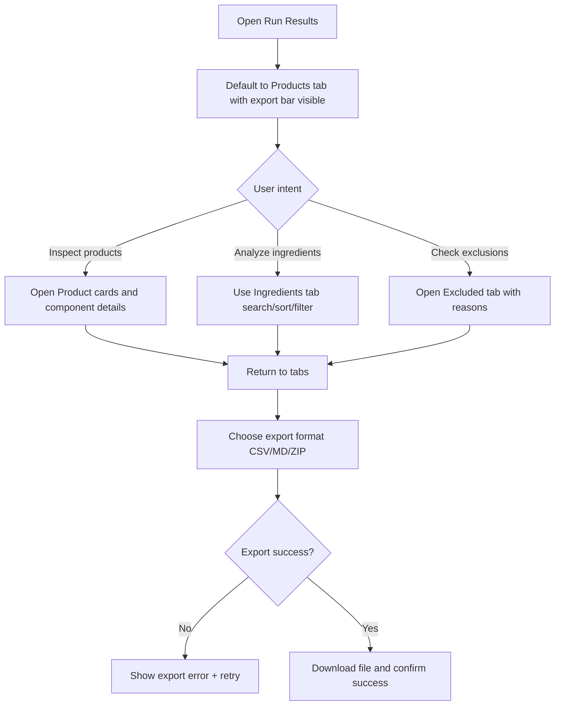

---
stepsCompleted:
  - 1
  - 2
  - 3
  - 4
  - 5
  - 6
  - 7
  - 8
  - 9
  - 10
  - 11
  - 12
  - 13
  - 14
lastStep: 14
inputDocuments:
  - _bmad-output/planning-artifacts/prd-formulation-wiki-web-app-2026-04-24.md
  - _bmad-output/planning-artifacts/architecture-formulation-wiki-web-app-2026-04-24.md
  - _bmad-output/planning-artifacts/epics-and-stories-formulation-wiki-web-app-2026-04-24.md
  - web-app-plan.md
---

# UX Design Specification formulation-wiki

**Author:** Srini
**Date:** 2026-04-24

---

<!-- UX design content will be appended sequentially through collaborative workflow steps -->

## Executive Summary

### Project Vision

Formulation Wiki is an internal, browser-based ingredient intelligence workspace that replaces a manual CLI scraping flow with a guided, persistent experience. The product enables users to submit scrape jobs, monitor long-running progress in real time, review classified ingredient results confidently, and export run-level and global datasets for downstream formulation analysis.

### Target Users

Primary users are solo operators or research leads who run scrape jobs, validate ingredient outputs, and perform comparative analysis across runs. Secondary users are small internal domain teams who primarily consume results and exports with minimal setup friction. The UX must support both technically comfortable and non-CLI users by making core workflows explicit, observable, and low-risk.

### Key Design Challenges

- Long-running background jobs must feel transparent and trustworthy, even when partial failures occur.
- Dense ingredient data (components, dye actives, mappings, frequencies) must remain scannable without overwhelming users.
- Multi-state flows (empty/loading/running/completed/error) must be consistently handled across screens to prevent confusion.
- Export and history workflows must preserve confidence that outputs match what users are seeing.

### Design Opportunities

- Create a highly legible ops dashboard experience for scraping progress with meaningful status semantics and next actions.
- Turn ingredient exploration into a fast insight workflow via strong defaults (sorting, filters, highlights, expandable details).
- Use consistent UX patterns for confidence cues (scope badges, dye-active emphasis, error context, completion affordances).
- Differentiate with analysis-ready from first run usability: low setup, immediate utility, and predictable export pathways.

## Core User Experience

### Defining Experience

The core experience is simple and outcome-driven: users input one or more product URLs, run extraction, review structured results, and download outputs. The interaction model should prioritize speed to outcome over configurability, with a clear path from submission to insight to export.

### Platform Strategy

Version 1 is web-only, optimized for mouse/keyboard workflows. No offline requirement is needed. No special device capability dependencies are required. The UX should focus on reliable desktop browser behavior and straightforward navigation between key screens (submission, progress, results, export).

### Effortless Interactions

- Submitting URLs should be low-friction and obvious, with immediate validation and clear next action.
- Progress and status should be visible without users needing to refresh, guess, or navigate away.
- Results should be easy to scan and interpret without technical knowledge of the underlying pipeline.
- Download actions should be one-click and always discoverable in context.
- Navigation should remain simple and predictable across all major flows.

### Critical Success Moments

- The key this is better moment is when extraction completes quickly and results are immediately viewable.
- First-time success happens when a user can submit URLs and reach usable, downloadable output without needing guidance.
- Make-or-break flow is end-to-end: submit -> track progress -> view results -> export.
- Any confusion in navigation or inability to find/download output is a critical UX failure.

### Experience Principles

- Prioritize speed from URL input to usable output.
- Keep navigation obvious, consistent, and low cognitive load.
- Make system status and progress continuously visible.
- Keep outputs immediately actionable through easy viewing and downloading.

## Desired Emotional Response

### Primary Emotional Goals

The primary emotional goal is confidence through visible progress and reliable outcomes. Users should feel that the system is actively working, that they are not waiting blindly, and that the final output is trustworthy and useful.

### Emotional Journey Mapping

- Entry (submit URLs): Users feel clear and oriented about what to do next.
- During run (progress phase): Users feel informed and in control because progress is visible and status updates are continuous.
- Results (completion): Users feel relief and confidence when outputs are quickly available and easy to review/download.
- Partial failure scenarios: Users still feel supported and productive through clear error context, preserved successful results, and obvious next actions.
- Return usage: Users feel this tool is faster and more dependable than manual workflows, making repeat use the default choice.

### Micro-Emotions

Critical micro-emotions to reinforce:
- Confidence over confusion
- Trust over skepticism
- Calm over anxiety while waiting
- Accomplishment over frustration at completion
- Satisfaction over uncertainty when exporting/using outputs

### Design Implications

- Confidence -> show persistent, real-time progress states with meaningful metrics (done/total, status, error count, completion signal).
- Trust -> make data lineage obvious (submitted URLs, run status, included/excluded outcomes, clear reasons).
- Calm during waits -> avoid dead-end loading states; always show what is happening now and expected next step.
- Accomplishment -> provide immediate completion affordances (view results + export) with minimal additional clicks.
- Resilience under failure -> preserve partial successes, explain failures clearly, and offer clear recovery/retry pathways.

### Emotional Design Principles

- Make progress continuously visible.
- Never leave users guessing what the system is doing.
- Reward completion with immediate, actionable outputs.
- Preserve user trust by being explicit about both success and failure.
- Optimize for speed-to-confidence, not just speed-to-response.

## UX Pattern Analysis & Inspiration

### Inspiring Products Analysis

**GitHub Actions**
- Strong status communication (queued/running/success/failure) reduces uncertainty during long-running tasks.
- Execution logs and timeline views build trust by showing exactly what happened.
- Clear success/failure outcomes help users recover quickly when something goes wrong.

**Vercel**
- Clean deploy/job progress presentation makes complex backend activity feel understandable.
- Fast path from status to actionable next step (view, retry, inspect) supports momentum.
- Visual hierarchy emphasizes what matters now, not every detail at once.

**Airtable**
- Highly scannable table interactions (sort/filter/search) make dense data usable.
- Information hierarchy supports both quick scanning and deeper drill-down.
- Familiar spreadsheet-like patterns reduce onboarding effort for non-technical users.

**Notion**
- Simple, predictable navigation and layout reduce cognitive load.
- Consistent interaction model improves confidence across different sections.
- Minimal visual clutter keeps users focused on outcomes.

**PostHog/Datadog dashboards**
- Operational metrics are presented with strong signal-to-noise control.
- Status and trend visibility supports in control emotions during active workflows.
- Good use of summary + detail layers (overview first, drilldown second).

### Transferable UX Patterns

**Navigation Patterns**
- Persistent top-level route model for the core flow: Submit -> Progress -> Results -> Global Insights.
- Stable tabbed navigation within results (Products | Ingredients | Excluded) for predictable movement.

**Interaction Patterns**
- Real-time status stream with explicit state labels and progress metrics.
- Immediate completion affordances (View Results, Download CSV/MD/ZIP) at the moment of success.
- Search/sort/filter as first-class controls for ingredient exploration.

**Visual Patterns**
- Strong status semantics (success/warning/error/progress) with consistent color and icon pairing.
- Overview then details structure: summary stats first, expandable detailed records second.
- Clear contrast between in-scope, excluded, and error outcomes to reduce interpretation effort.

### Anti-Patterns to Avoid

- Hidden system state (spinners without context, no progress detail, silent failures).
- Navigation that forces users to backtrack or re-discover where outputs live.
- Overly dense data views without prioritization, causing analysis fatigue.
- Export actions buried below fold or separated from the results context.
- Over-animated or decorative UI that reduces perceived speed and operational trust.

### Design Inspiration Strategy

**What to Adopt**
- GitHub Actions/Vercel style status clarity and event progression for run tracking.
- Airtable-like analysis controls (sort/filter/search) for ingredient result workflows.
- Notion-like navigation simplicity and page-level consistency.

**What to Adapt**
- Dashboard density from PostHog/Datadog should be simplified for mixed technical users.
- Log-style detail views should be secondary to concise summaries and task completion actions.
- Table power should remain focused on key analysis tasks, not full BI complexity.

**What to Avoid**
- Enterprise-style complexity that increases setup/training burden.
- Multi-layered navigation structures that hide primary actions.
- Ambiguous error language that weakens trust and increases retry anxiety.

## Design System Foundation

### 1.1 Design System Choice

Use a themeable design system built on Shadcn/ui + Tailwind CSS as the primary UI foundation for Formulation Wiki (web-only).

### Rationale for Selection

- Speed + flexibility balance: Faster than fully custom UI, while still allowing brand-level customization.
- Matches current architecture and plan: Already aligned with your documented stack and implementation direction.
- Great for internal tools: Clean, practical components for forms, tables, tabs, cards, and status surfaces.
- Strong consistency: Supports predictable interaction patterns across submission, progress, results, and export flows.
- Maintainability: Token-based styling and composable primitives keep long-term UI changes manageable.

### Implementation Approach

- Build core layouts and interaction-heavy views using Shadcn primitives (Card, Tabs, Table, Badge, Button, Tooltip, Sheet, Toast, Skeleton).
- Use Tailwind utility conventions for spacing, hierarchy, responsive behavior, and state styling.
- Treat status semantics as first-class primitives:
  - running/progress
  - success/complete
  - warning/partial failure
  - error/failure
- Define reusable feature components early:
  - URL input area
  - Progress panel + live feed
  - Product card
  - Ingredient table
  - Export bar

### Customization Strategy

- Adopt design tokens aligned to existing palette intent:
  - Primary: violet
  - Accent/warning: amber
  - Success: emerald
  - Error: red
  - Neutral backgrounds/surfaces for high readability
- Standardize status badges, icon usage, and copy tone for trust and clarity.
- Keep visual style minimal and operational (signal over decoration).
- Introduce custom components only when Shadcn primitives cannot support key UX requirements.
- Ensure accessibility defaults (contrast, focus states, keyboard navigation) are preserved throughout customization.

## 2. Core User Experience

### 2.1 Defining Experience

The defining experience of Formulation Wiki is:
Paste URLs, run extraction, watch live progress, and immediately act on results.

If this interaction is fast, transparent, and reliable, the whole product succeeds. Users should be able to move from input to trustworthy output with minimal friction and no ambiguity about system state.

### 2.2 User Mental Model

Users currently think in a CLI/manual pipeline model: provide sources, wait, inspect outputs, then export and analyze. They expect:
- Clear start action (submit URLs)
- Continuous status visibility while processing
- A reliable handoff from job running to results ready
- Easy access to downloadable outputs

Likely friction points in existing approaches:
- Waiting without clear progress
- Uncertainty about failures vs successful partial completion
- Difficulty locating or interpreting final outputs

### 2.3 Success Criteria

Core interaction succeeds when users experience:
- Clarity: they always know current state (idle/running/completed/error/partial).
- Speed-to-outcome: they can submit and reach usable results quickly.
- Trust: system behavior and outputs feel dependable.
- Actionability: view + export paths are immediate and obvious.

Success indicators:
- Users can submit a run without assistance.
- Users can understand progress without refreshing or guessing.
- Users can reach and download correct outputs in one obvious path.

### 2.4 Novel UX Patterns

This product primarily uses established operational UX patterns rather than novel interaction models:
- Familiar job submission and processing pattern
- Dashboard-style progress and status feedback
- Table-and-card result exploration with filters and sorting

Innovation comes from combining familiar patterns into a low-friction, analysis-first workflow optimized for this specific ingredient extraction use case.

### 2.5 Experience Mechanics

**1. Initiation**
- User pastes one or more URLs (or uploads formatted input).
- UI validates input and enables a clear primary action to start run.

**2. Interaction**
- User starts extraction job.
- System transitions immediately to progress experience.
- User can monitor run via live metrics and item-level status updates.

**3. Feedback**
- Real-time progress and status events reduce uncertainty.
- Errors are explicit, contextual, and non-blocking when partial success is possible.
- Status semantics remain consistent across screens.

**4. Completion**
- System clearly signals completion.
- User is guided directly to results.
- Export actions (CSV/MD/ZIP/master CSV) are prominent and immediate.

## Visual Design Foundation

### Color System

Use a light-first palette designed for clarity, calmness, and trust in data-heavy workflows.

**Core intent**
- Default to white and near-white surfaces.
- Use neutral grays for structure and readability.
- Reserve saturated colors for meaningful status and actions only.

**Proposed semantic palette**
- Background (page): `#FAFAF8`
- Surface (cards/panels): `#FFFFFF`
- Subtle surface: `#F5F5F4`
- Border/divider: `#E7E5E4`
- Primary text: `#1C1917`
- Secondary text: `#57534E`
- Primary action (calm violet): `#7C3AED`
- Primary action hover: `#6D28D9`
- Accent/warning (amber): `#F59E0B`
- Success: `#10B981`
- Error: `#EF4444`
- Info/progress: `#3B82F6`

**Usage rules**
- Keep base UI mostly neutral; avoid color-heavy backgrounds.
- Use status colors only for semantics (success/warning/error/progress), not decoration.
- Preserve high contrast for data tables and key labels.

### Typography System

Adopt a clean sans-serif system prioritizing readability and operational scanning.

**Font strategy**
- Primary UI font: `Inter` (fallback: `system-ui, -apple-system, Segoe UI, Roboto, sans-serif`)
- Mono (optional for technical values): `ui-monospace, SFMono-Regular, Menlo, monospace`

**Type scale**
- H1: 30/36, semibold
- H2: 24/32, semibold
- H3: 20/28, semibold
- Body large: 16/24, regular
- Body: 14/22, regular
- Meta/caption: 12/18, medium

**Hierarchy principles**
- Prioritize strong section titles and concise supporting text.
- Use weight/size changes before introducing extra color.
- Keep dense data views legible with consistent row typography.

### Spacing & Layout Foundation

Use an 8px spacing system with generous section spacing and compact data rows where needed.

**Spacing system**
- Base unit: 8px
- Component paddings: 12/16/24
- Section spacing: 24/32/40
- Card radius: 10-12px
- Input/button height targets: 36-40px

**Layout principles**
- Desktop-first, web-only layout optimized for mouse/keyboard.
- Clear vertical rhythm: input -> progress -> results -> export actions.
- Use summary-first layouts (top metrics/actions), then details below.
- Keep navigation shallow and predictable.

### Accessibility Considerations

- Ensure WCAG AA contrast for all text and controls.
- Never encode status with color alone (always pair with icon/label).
- Preserve visible focus states for keyboard navigation.
- Keep tap/click targets comfortably sized even in dense table contexts.
- Provide clear empty, loading, partial-failure, and error states with actionable guidance.

## Design Direction Decision

### Design Directions Explored

Eight visual directions were explored in `_bmad-output/planning-artifacts/ux-design-directions.html`, spanning:
- Summary-first dashboard layouts vs telemetry-heavy operational views
- Results-first and export-first layouts
- Guided step flow vs flexible dashboard navigation
- Card-first readability vs table-centric power analysis
- Lower density vs compact density information presentation

### Chosen Direction

Selected a hybrid direction:
- **Base:** Direction 1 (Calm Dashboard)
- **Combined elements:** Direction 3 export emphasis + Direction 7 table utility

This direction balances clarity, speed-to-outcome, and analytical depth while preserving a light, premium visual feel.

### Design Rationale

- Aligns with user goals: visible progress, fast output access, easy navigation.
- Maintains low cognitive load through summary-first hierarchy.
- Preserves power-user efficiency with strong ingredient table capabilities.
- Keeps exports highly discoverable and action-oriented at completion.
- Matches emotional goals: confidence, trust, and calm during long-running workflows.

### Implementation Approach

- Use calm dashboard shell as default page structure.
- Keep prominent top-level progress and status cards in run views.
- Make export actions persistent and high-visibility in results contexts.
- Use table-centric controls (sort/filter/search) for ingredient analysis with progressive detail.
- Maintain consistent status semantics and neutral-first visual style across screens.

## User Journey Flows

### Journey 1: Submit Scrape Job

Goal: User quickly starts a valid scrape run with confidence.

Key UX notes:
- Validation must be immediate and visible.
- Primary CTA remains disabled until valid input exists.
- Failure path should preserve entered URLs and allow one-click retry.

### Journey 2: Track Live Progress

Goal: User feels informed and in control while job runs.

Key UX notes:
- Never show passive spinner-only state; always show explicit status.
- Partial errors should not block progress visibility.
- Completion should transition to clear next action immediately.

### Journey 3: Review and Export Results

Goal: User can understand outcomes and download usable files quickly.

Key UX notes:
- Export actions stay persistent and obvious.
- Information hierarchy: summary first, details on demand.
- Empty/zero states must be explicit and reassuring.

### Journey Patterns

- Navigation pattern: linear macro-flow (Submit -> Progress -> Results), tabbed micro-flow within Results.
- Decision pattern: validate early, gate destructive/invalid actions, provide immediate recovery.
- Feedback pattern: real-time status + explicit state labels + contextual error messaging.
- Action pattern: persistent high-value actions (View Results, Export) at the moment of user readiness.

### Flow Optimization Principles

- Minimize time-to-first-success for first run.
- Keep users continuously informed during asynchronous processing.
- Prioritize trust signals over visual flourish.
- Preserve momentum with immediate next-step actions.
- Ensure partial-failure resilience without losing completed value.

## Component Strategy

### Design System Components

Using Shadcn/ui + Tailwind as foundation, we can directly use:

- Layout/surfaces: Card, Separator, Sheet, ScrollArea
- Navigation: Tabs, Breadcrumb, Navigation Menu
- Inputs/actions: Input, Textarea, Button, Dropdown Menu, Tooltip
- Feedback/state: Badge, Progress, Skeleton, Toast, Alert
- Data views: Table, Collapsible/Accordion
- Dialog flows: Dialog, AlertDialog

These components cover most structural and interaction needs for the core flows.

### Custom Components

### UrlInputPanel

**Purpose:** Fast URL ingestion and job kickoff.  
**Usage:** Home screen primary interaction block.  
**Anatomy:** URL textarea, upload trigger, domain chips, validation hints, primary CTA.  
**States:** default, invalid URLs, valid/ready, submitting, submit error.  
**Variants:** compact (embedded), full (home hero).  
**Accessibility:** labeled textarea, inline error association, keyboard-submit support.  
**Content Guidelines:** one URL per line, clear examples, explicit validation messages.  
**Interaction Behavior:** validate on input change; disable submit until valid.

### JobProgressBoard

**Purpose:** Real-time confidence during processing.  
**Usage:** Job progress page while run is active/completing.  
**Anatomy:** progress summary, metric cards, live feed list, completion CTA.  
**States:** connecting, live, reconnecting, partial-error, complete.  
**Variants:** standard and compact metrics view.  
**Accessibility:** live region for key status updates, non-color status cues.  
**Content Guidelines:** concise status labels and actionable error snippets.  
**Interaction Behavior:** SSE-driven incremental updates with graceful reconnect.

### ProductResultCard

**Purpose:** Readable product-level outcome with ingredient structure.  
**Usage:** Products tab in run results.  
**Anatomy:** header (name/status), dye-active summary, component sections, expand/collapse controls.  
**States:** in-scope, excluded, no-ingredients, expanded/collapsed.  
**Variants:** compact preview vs full detail.  
**Accessibility:** semantic heading hierarchy, keyboard toggle for collapsibles.  
**Content Guidelines:** preserve INCI text; highlight dye actives consistently.  
**Interaction Behavior:** default collapsed for long lists; expand on demand.

### IngredientAnalysisTable

**Purpose:** High-speed ingredient insight and comparison.  
**Usage:** Run and global ingredients views.  
**Anatomy:** search, filters, sortable columns, frequency bar, row-expansion details.  
**States:** loading, empty, filtered-empty, populated, error.  
**Variants:** per-run and global mode.  
**Accessibility:** sortable header semantics, clear focus indicators, text alternatives for bars.  
**Content Guidelines:** prioritize ingredient name, internal mapping, count.  
**Interaction Behavior:** client-side sort/filter/search with stable defaults.

### ExportActionBar

**Purpose:** Keep output actions constantly discoverable.  
**Usage:** Top of run results and relevant analysis contexts.  
**Anatomy:** run summary, CTA cluster (CSV/MD/ZIP/master CSV), feedback state.  
**States:** available, generating, download-ready, failed.  
**Variants:** run-level and global-level.  
**Accessibility:** explicit button labels and success/error announcements.  
**Content Guidelines:** short labels, format clarity, immediate confirmation.  
**Interaction Behavior:** one-click trigger with visible completion/failure feedback.

### Component Implementation Strategy

- Use Shadcn primitives for structure and behavior; wrap with domain components above.
- Standardize state semantics across all components:
  - running/progress
  - success/complete
  - warning/partial
  - error/failure
- Centralize design tokens (color, spacing, radius, typography) to keep custom components visually consistent.
- Ensure each custom component has explicit loading/empty/error/success states.
- Favor composability and prop-driven variants over one-off bespoke implementations.

### Implementation Roadmap

**Phase 1 - Core Flow Components**
- UrlInputPanel
- JobProgressBoard
- ExportActionBar

**Phase 2 - Analysis Components**
- ProductResultCard
- IngredientAnalysisTable

**Phase 3 - Supporting Enhancements**
- Empty/zero-state variants
- Advanced filter controls
- Additional accessibility and keyboard optimizations

## UX Consistency Patterns

### Button Hierarchy

**Primary Action**
- Use for the single highest-value action per screen (e.g., Start Scraping, View Results, Download Primary Export).
- Visual: filled primary (violet), strong contrast, clear label.
- Limit to one primary button per view region.

**Secondary Action**
- Use for supporting actions (e.g., View Details, Open Filters).
- Visual: outline or subtle filled neutral style.
- Should never visually compete with the primary action.

**Tertiary/Text Action**
- Use for low-risk utility interactions (e.g., Cancel, Reset filters, Learn more).
- Visual: text/link style with clear hover/focus state.

**Destructive Action**
- Use only when irreversible or high-risk behavior exists.
- Visual: red emphasis with explicit confirmation patterns.

### Feedback Patterns

**Success**
- Use concise confirmation (toast or inline status) with explicit outcome.
- Example: Export ready. CSV downloaded.

**Info/Progress**
- Always show current status for async jobs (queued/running/completed).
- Pair numeric progress with semantic label (not color only).

**Warning/Partial Failure**
- Show non-blocking warnings when partial success exists.
- Preserve successful output and provide clear next actions.

**Error**
- Use clear cause + actionable recovery.
- Avoid vague copy; include retry path where possible.

### Form Patterns

**Validation**
- Validate early and inline for URL inputs.
- Disable submit until required validity conditions pass.
- Preserve user input on errors.

**Input Guidance**
- Show format hints and example URLs near controls.
- Keep error text directly associated with offending field.

**Submission Behavior**
- On submit, show immediate state change (loading label/progress transition).
- Prevent duplicate submits while request is in-flight.

### Navigation Patterns

**Macro Flow**
- Keep top-level flow consistent: Submit -> Progress -> Results -> Global Ingredients.
- Maintain predictable route naming and back-navigation behavior.

**Micro Navigation**
- Use tabs inside results for Products | Ingredients | Excluded.
- Preserve tab/filter/sort state during in-session navigation where possible.

**Action Placement**
- Keep high-value actions persistent in predictable locations (e.g., export bar at top of results).

### Additional Patterns

**Empty States**
- Every empty state must explain why it is empty and what to do next.

**Loading States**
- Use skeletons/placeholders for data views; avoid spinner-only dead states.

**Search & Filter**
- Real-time client-side feedback with obvious reset/clear affordance.

**Status Semantics**
- Standardize labels and visual tokens:
  - Running/Progress
  - Complete/Success
  - Partial/Warning
  - Failed/Error

**Modal & Confirmation**
- Use modals only for critical interruption points.
- Prefer inline expansion/drawers for exploratory details.

### Design System Integration Notes

- Implement all patterns using Shadcn primitives with Tailwind tokens.
- Centralize status badge variants and button intent mapping in shared UI layer.
- Enforce keyboard focus visibility and ARIA semantics across pattern implementations.

## Responsive Design & Accessibility

### Responsive Strategy

Given the product goal and user context, use a desktop-first but fully responsive web strategy:

- Desktop (primary): maximize operational clarity with summary + detail layouts, side-by-side where useful.
- Tablet (secondary): simplify multi-column layouts into stacked panels while preserving core metrics visibility.
- Mobile (supporting): prioritize critical actions and status visibility; reduce density and progressive disclosure for detail-heavy content.

Core principle: never hide job status or primary actions behind complex navigation.

### Breakpoint Strategy

Use practical Tailwind-aligned breakpoints with behavior-specific adjustments:

- Mobile: < 768px
- Tablet: 768px - 1023px
- Desktop: >= 1024px
- Wide desktop enhancement: >= 1280px for richer side-by-side analysis views

Layout behavior:
- Results tabs remain accessible at all sizes (horizontal scroll if needed).
- Tables collapse non-critical columns on small screens.
- Progress metrics shift from multi-card row to stacked cards on smaller viewports.

### Accessibility Strategy

Target WCAG 2.2 AA as baseline (recommended and realistic for this product).

Key requirements:
- Text contrast >= 4.5:1 for normal text; >= 3:1 for large text/UI components.
- Full keyboard navigation for all core flows (submit, monitor, analyze, export).
- Visible focus states for every interactive element.
- Semantic headings and landmarks for screen reader orientation.
- Status and error communication must not rely on color alone.
- Minimum target sizes near 44x44 for touch-accessible controls where relevant.

### Testing Strategy

**Responsive testing**
- Validate critical flows at 375px, 768px, 1024px, and 1440px widths.
- Test Chrome, Edge, and Safari (plus Firefox when available).
- Verify tab, table, and export interactions at each breakpoint.

**Accessibility testing**
- Automated checks (axe/lighthouse) integrated into QA pass.
- Keyboard-only walkthrough for all primary journeys.
- Screen reader smoke tests (VoiceOver/NVDA) for major pages.
- Contrast and color-semantic validation for status-heavy screens.

**Scenario testing focus**
- Empty/loading/error/partial-success states across device classes.
- SSE progress updates and announcements under assistive tech.
- Export success/failure feedback discoverability and clarity.

### Implementation Guidelines

**Responsive implementation**
- Use mobile-safe component behavior even in desktop-first layouts.
- Prefer fluid widths and responsive utility classes over fixed pixel assumptions.
- Use progressive disclosure for dense analysis UI at small sizes.

**Accessibility implementation**
- Use semantic HTML first; apply ARIA only where needed.
- Add ARIA-live regions for meaningful progress updates.
- Ensure dialogs/sheets manage focus correctly (trap + return focus).
- Keep form validation inline and programmatically associated with fields.
- Provide clear, actionable error copy and recovery paths.

## Wireframes & Prototype

A low-fidelity, static prototype has been added to help visualize key screens and basic navigation. Open the prototype index in a browser to click through the screens.

- Prototype files: `_bmad-output/planning-artifacts/prototypes/` (index.html, dashboard.html, job_submission.html, results.html, ingredient_detail.html, export.html)

Quick notes about the prototype:
- It is intentionally low-fidelity and intended for rapid review and navigation testing.
- Use it to validate major flows: Submit -> Progress -> Results -> Export.
- Screens include placeholders for live progress, result listings, ingredient detail, and export actions.

Would you like me to:
- [A] Summarize screens and UX gaps from the prototype
- [B] Export the prototype as a ZIP for sharing
- [C] Iterate on a higher-fidelity wireframe (SVG or Figma-ready spec)

